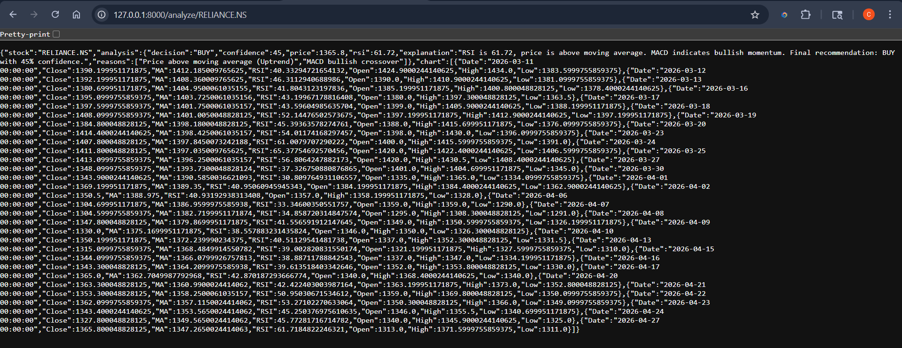
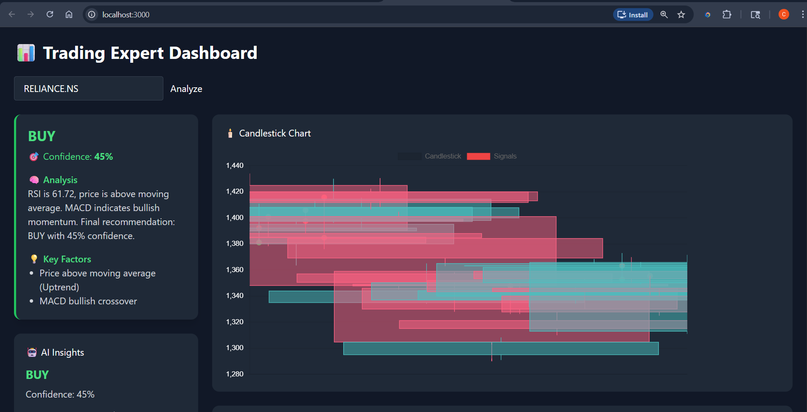
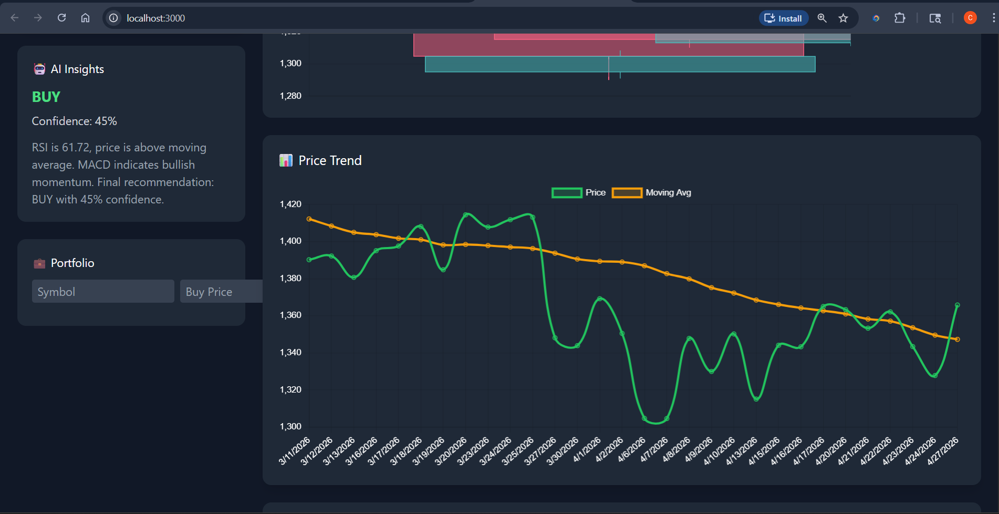
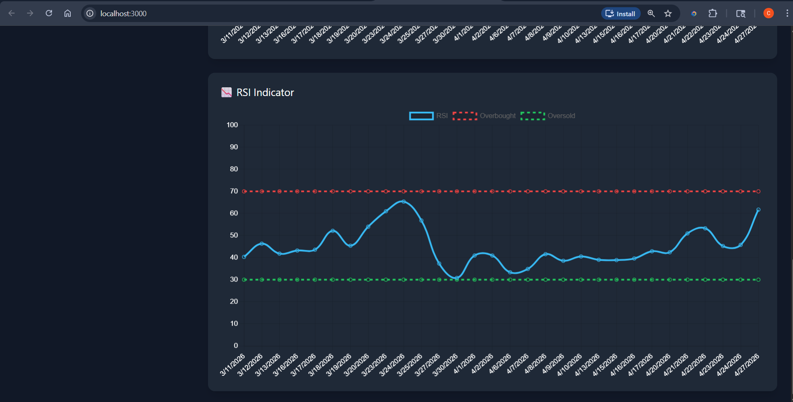

# 📊 Stock Market Expert System

### Intelligent Trading Decision Support System using AI Concepts

---

## 📌 Overview

This project presents the design and implementation of an **Advanced Expert System for Stock Market Trading Decisions**. The system mimics the reasoning of a financial expert by analyzing market data using multiple technical indicators and rule-based inference.

Unlike basic systems, this solution provides:

* 📈 Data-driven insights
* 🧠 Expert-level reasoning
* 📊 Visual analytics
* 🎯 Confidence-based recommendations

The system helps users make informed **Buy / Sell / Hold** decisions while reducing emotional bias in trading.

---

## 🎯 Objectives

* To develop an intelligent **decision support system** for stock trading
* To implement **rule-based inference using technical indicators**
* To provide **visual insights using charts and dashboards**
* To simulate **human expert reasoning in financial analysis**

---

## 🧠 System Architecture

```plaintext
User Interface (React Dashboard)
        ↓
API Layer (FastAPI Backend)
        ↓
Expert System Engine
   ├── Indicator Engine
   ├── Rule Engine
   ├── Confidence Engine
   ├── Explanation Engine
        ↓
Stock Data (yfinance API)
```

---

## ⚙️ Features

### 📊 Technical Analysis

* Moving Average (MA) – Trend detection
* Relative Strength Index (RSI) – Overbought/Oversold signals
* MACD – Momentum and crossover signals
* Bollinger Bands – Volatility analysis

### 🤖 Expert Decision Engine

* Rule-based inference system
* Multi-factor decision making
* Generates:

  * BUY / SELL / HOLD signals
  * Confidence score (%)
  * Market trend

### 📈 Visualization

* Price vs Moving Average chart
* Trend visualization
* Interactive dashboard

### 🧾 Explanation System

Provides human-like reasoning such as:

> “RSI indicates oversold condition while MACD shows bullish crossover, suggesting a potential upward movement.”

### ⚡ Additional Features

* Real-time stock data integration
* Error handling and validation
* API-based architecture (frontend-ready)

---

## 🛠️ Tech Stack

### 🔹 Backend

* Python
* FastAPI
* Pandas, NumPy
* yFinance API

### 🔹 Frontend

* React.js
* Chart.js / Recharts
* Tailwind CSS (optional styling)

---

## 📂 Project Structure

```plaintext
stock-expert-system/
│
├── backend/
│   ├── expert_system.py
│   ├── requirements.txt
│
├── frontend/
│   ├── src/
│   ├── package.json
│
└── README.md
```

---

## ▶️ How to Run the Project

### 🔹 Backend Setup

```bash
cd backend
pip install -r requirements.txt
uvicorn expert_system:app --reload
```

API Docs:
👉 http://127.0.0.1:8000/docs

---

### 🔹 Frontend Setup

```bash
cd frontend
npm install
npm start
```

---

## 🔍 Sample Output

* 📊 Signal: **STRONG BUY**
* 🎯 Confidence: **82%**
* 📈 Trend: **Uptrend**
* 💡 Reason:

  * RSI indicates oversold condition
  * MACD shows bullish crossover
  * Price above moving average

---

## 📸 Screenshots






---

## ✅ Advantages

* Reduces emotional trading decisions
* Provides consistent and logical analysis
* Beginner-friendly decision support
* Scalable and extensible system

---

## ⚠️ Limitations

* Based on predefined rules (not fully AI predictive)
* Cannot account for sudden market events or news
* Depends on accuracy of historical data

---

## 🚀 Future Enhancements

* Machine Learning-based prediction
* News sentiment analysis
* Portfolio management module
* Live trading integration
* Mobile app interface

---

## 👨‍💻 Author

Developed as part of an academic mini-project in Artificial Intelligence / Data Science.

---

## 📜 License

This project is for educational purposes only.
